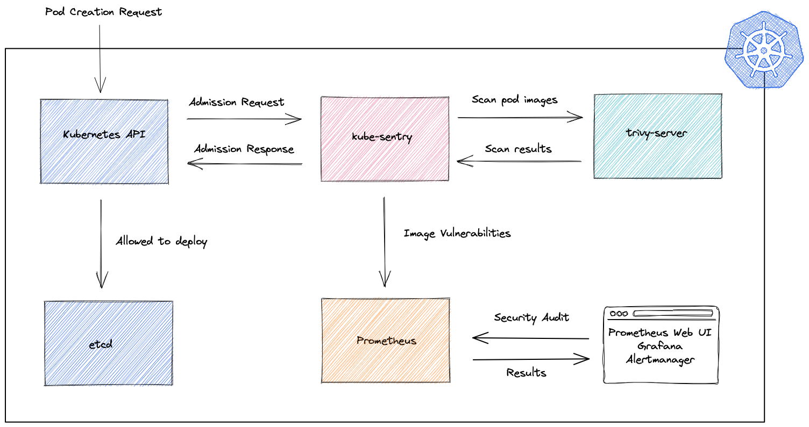

# kube-sentry

kube-sentry is a validating admission webhook for Kubernetes that scans incoming container images for vulnerabilities, exports scan results to prometheus, and can prevent pods from being created based on user specified rules.



## Installation

kube-sentry can be installed with the included helm chart

```bash
helm install kube-sentry -n kube-sentry --create-namespace .
```

## Dependencies

kube-sentry requires a remote trivy server for scanning container images. This can be installed using the trivy helm chart https://github.com/aquasecurity/trivy/tree/main/helm/trivy.

## Configuration

| Argument          | Description                                                           |
|-------------------|-----------------------------------------------------------------------|
| `tlsCertFile`     | Location of the TLS certificate                                       |
| `tlsKeyFile`      | Location of the TLS private key                                       |
| `logLevel`        | Specifies the logging level (info or debug)                           |
| `insecure`        | If trivy scan request should be insecure                              | 
| `listenAddr`      | Address for kube-senty to listen for validation requests              |
| `metricsAddr`     | Address to serve prometheus metrics                                   | 
| `trivyAddr`       | Address of the trivy server to send scan request                      | 
| `trivyScheme`     | Scheme to communicate to remote trivy server                          |
| `metricsLabels`   | Specifies the metrics labels to export. If not given, will export all |
 | `sentryMode`      | Enables rejecting pods based on trivy scan results                    |
| `forbiddenCves`   | Specifies which CVEs in images causes pod validation to fail          |
| `numCriticalCves` | Max number of critical CVEs pod images can have                       |
| `numAllowedCves`  | Max number of CVEs pod images can have                                |


## Contributing
Contributions are always welcome. Please open an issue to discuss what you would like to change.

