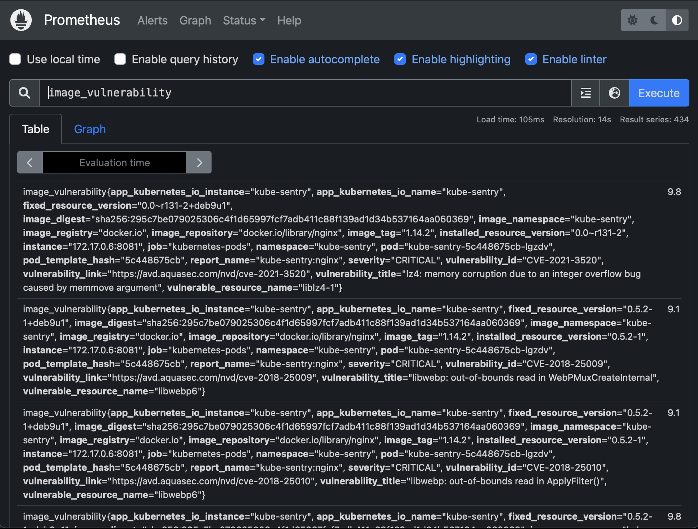
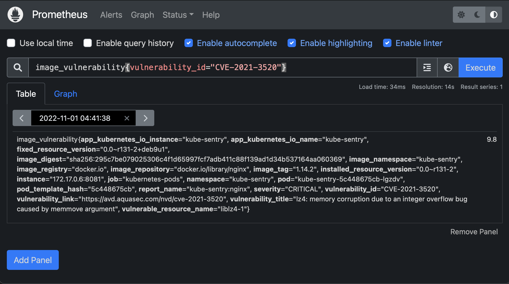

# Vulnerability Results and Metrics

### Prometheus Metrics
After an image is scanned, the scan results will be exported to prometheus. The labels to export can be configured. 

By default, all labels are enabled.
```yaml
metricsLabels: "report_name, image_namespace, image_registry, image_repository, 
image_tag,image_digest, severity, vulnerability_id, vulnerable_resource_name, 
installed_resource_version, fixed_resource_version, vulnerability_title, 
vulnerability_link"
```

Prometheus queries can be used to gain insight into image vulnerabilities on your cluster. This can be useful for auditing purposes.
A metric is exported for every vulnerability detected in each container image. 



Labels can be used to narrow down and filter results.



